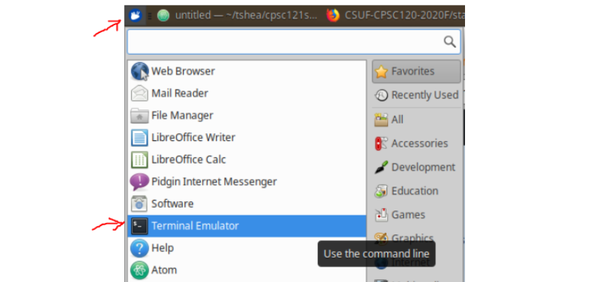

# Lab Exercise 0 Objectives
1. Navigate and explore Tuffix, a Linux environment.
2. Write C++ code on the Atom editor.
3. Navigate the Linux file system using a command line interface (CLI).
4. Compile C++ code.
5. Run compiled code (executable files).
6. Use git to add and commit code to the local staging area as well as push code to a GitHub repository.

# Instructional Videos
Here are some instructional videos that you can view to know more about Tuffix and the command line.
1. Running Tuffix using Virtual Box (https://youtu.be/otB9FPC86a8?t=1m54s)
2. Intro to Tuffix (https://youtu.be/c0ZrWmarSwI)
3. Intro to the Linux command line (https://youtu.be/bQm8TUTDK7E)
4. Intro to Atom and clang++ compilation (https://youtu.be/TYlg3Ka8Mos) (Replace all the g++ commands with clang++)

# Instructions
Follow the steps listed below to complete this lab exercise.
1. Make sure that the shared clipboard of VirtualBox is set to *Bidirectional* to allow you to easily copy and paste text between your host operating system and your virtual machine.
 
1. Open the Terminal in Tuffix through the Whisker menu.
 
1. Make a copy of this GitHub repository on your computer using the `git` and `clone` commands that you will input to the terminal. The commands take a URL as a parameter to specify where it can get a copy of the repository. You can find the URL by clicking on the green *Code* button at the top right part of this page, and select to *Copy* the URL.  
     
1. In a *Terminal* window, type `git clone` followed by the copy of the URL from the previous step. When you hit <kbd>Enter</kbd> it will ask you to provide your GitHub username and password. Once done, you will have a copy of the repository on your computer.
 
    ```
    git clone <URL>
    ```
    For example:
    ```
    git clone https://github.com/CSUF-CPSC120-2020F/labex00-tuffy.git
    ```
1. Navigate into your `labex00` folder using the command line. Take note that this will vary per user because the folder name is based on your GitHub username. The example below assumes the user's username is Tuffy. Replace it with your own folder name. Take note that you can type the first few letters of the folder name and press <kbd>Tab</kbd> so that it auto completes the folder name for you.

    ```
    cd labex00-<github username>
    ```
    For example:
    ```
    cd labex00-tuffy
    ```
1. Your *lab exercise 0* folder will contain files you need for this exercise. Use the Atom editor to implement C++ code that will print *Hello world* on the screen. You are welcome to use the code shown below, and paste it into a file named *hello.cpp* inside your *lab exercise 0* folder. Note: you can open Atom either from the Tuffix menu, or instead you could type `atom hello.cpp` from the *Terminal* window, which will create the file in the current directory.

    ```
    #include <iostream>
    int main()
    {
        std::cout << "Hello world" << std::endl;
        return 0;
    }
    ```
1. *Compile*
   - Compile the file using the command below. The `-std` option tells the compiler that it will use C++ version 17 standards and the `-o hello` option tells the compiler to place the executable code into an executable file called `hello`. An *executable* is a file that can be run on the computer. For instance, the executable created using the *hello.cpp* file runs the C++ code that outputs "Hello World"
   
    ```
    clang++ -std=c++17 hello.cpp -o hello
    ```
1. *Run*
   - Run the program using `./` followed by the name of the executable created in the previous step. For example, to run the executable created for the *hello.cpp* file, you would type the following.
   
    ```
    ./hello
    ```
1. When everything runs correctly, copy your code into the GitHub repository. The first step is to add *hello.cpp* to what is called the staging area using git's `add` command. The parameter after `add` is the name of the file you want to add.

    ```
    git add hello.cpp
    ```
    If you would like to add all files that have changed, you can do so by using the period symbol in place of the file name.
    
    ```
    git add .
    ```
1. Once everything is in the staging area, we use the `commit` command to tell git that we have added everything we need into the staging area. You can replace *Message* below with your own short description of what you are checking into GitHub.

    ```
    git commit -m "Message"
    ```
1. In case it asks you to configure global variables for an email and name, copy the commands shown on screen and replace the dummy text with your email and GitHub username.

    ```
    git config --global user.email "tuffy@csu.fullerton.edu"
    git config --global user.name "Tuffy Titan"
    ```
    When you're done, make sure you type the same `git commit` again. You can bring that command up by hitting the up-arrow key twice.   
1. Alternatively, if you do not provide a *Message* on the `git commit` command, git will ask you to describe what you have added to the staging area. By default, you will use a command-line based editor called *nano*. Go ahead and provide a description then press <kbd>Ctrl</kbd> + <kbd>x</kbd> to exit. Press <kbd>Y</kbd> to confirm that you want to make changes and then press <kbd>Enter</kbd>.
1. Finally, push all changes to the GitHub repository using git's `push` command. Provide your GitHub username and password when you are asked.

    ```
    git push
    ```
1. Congratulations, you have now completed your C++ lab exercise on GitHub! Refresh this page and you should see the *hello.cpp* file you pushed from your command line show up in the list of files in your git repo.

# Linux/Ubuntu Commands
For our lab assignments, we will be using the Ubuntu operating system, which is Linux based. Below are some of the basic commands you will need.
1. `ls`
    - Display all files and folders in the current directory.
    
    ```
    teshea@ThinkPad-T420:~$ ls
    Desktop
    ```
1. `mkdir`
    - Create a new directory in the current location. For example, the following creates a new directory named *labs*.
    
    ```
    teshea@ThinkPad-T420:~$ mkdir labs
    ```
1. `cd`
    - Change directory. For example, the following changes directory into the newly created *labs* folder. You will notice the command prompt updates with the new folder location.
    
    ```
    teshea@ThinkPad-T420:~$ cd labs
    teshea@ThinkPad-T420:~/labs$
    ```
1. `pwd`
    - Display the full path of the current directory.
    
    ```
    teshea@ThinkPad-T420:~/labs$ pwd
    /home/teshea/labs
    ```
1. `cp`
    - Copy a file to a new name. For example, the following makes a complete copy of the file *hello.cpp* into a new file *main.cpp* so that you now have two copies of the same file.
    
    ```
    teshea@ThinkPad-T420:~/labs$ cp hello.cpp main.cpp
    ```
1. `mv`
    - Move a file to a new name (i.e., rename the file). For example, the following changes the name of the file *hello.cpp* to *main.cpp* so that you still have only one file, but it has a new name now.
    
    ```
    teshea@ThinkPad-T420:~/labs$ mv hello.cpp main.cpp
    ```
1. `rm`
    - Remove a file (i.e., delete the file). For example, the following deletes the file *hello.cpp* off disk.
    
    ```
    teshea@ThinkPad-T420:~/labs$ rm hello.cpp
    ```
1. `cat`
    - Display the full contents of a file to the Terminal/console window.
    
    ```
    teshea@ThinkPad-T420:~/labs$ cat hello.cpp
    #include <iostream>
    int main()
    {
        std::cout << "Hello world" << std::endl;
        return 0;
    }
    ```
1. `..`
    - Two period symbols together always represents *up one directory* and can be used for things like copying a file to the parent directory, listing all files in the parent directory, or changing directory back to the parent directory. These are just a few examples of its usage. Notice the final command prompt in the examples below no longer shows *labs* in the directory after changing directory to the parent.
    
    ```
    teshea@ThinkPad-T420:~/labs$ cp hello.cpp ..
    teshea@ThinkPad-T420:~/labs$ ls ..
    labs  hello.cpp
    teshea@ThinkPad-T420:~/labs$ cd ..
    teshea@ThinkPad-T420:~$
    ```
1. Additional Tips.
   - (1) You can bring up the previous command you typed by pressing the *up arrow*. You can also press it multiple times in order to find a command you typed several commands ago. If you have gone too far, then press the *down arrow*. Basically, the up and down arrow keys allow you to scroll up and down the list of previous commands you have typed.
   - (2) You can have the computer complete the name of the file or directory you are typing by hitting the <kbd>tab</kbd> key. This is valid only when you have a unique combination of characters already typed. For instance, if you want to display the contents of your file *hello.cpp* and you type `cat he` followed by the <kbd>tab</kbd> key, the computer will complete your command and display `cat hello.cpp`.

1. Get a copy of your lab exercise from GitHub
   - Clone your lab exercise (get the URL from the *Code* button on GitHub as described in the previous section),
   - Change directory into your lab assignment (replace *tuffy* with your GitHub username and replace *labex01* with whichever lab exercise you are working on),
   - And list all probs that are a part of this lab assignment
   
    ```
    git clone <URL>
    cd labex01-tuffy
    ls
    ```
1. Code Evaluation (compile and execute your code)

    ```
    clang++ -std=c++17 *.cpp -o main
    ./main
    ```
1. Submission (push your code to GitHub)

    ```
    git add .
    git commit -m "Short comment"
    git push
    ```
1. Additional git commands
   - `git pull` - This command brings down any changes from GitHub into your local repository. This is necessary only if you made changes in GitHub directly and need to update your local repository with those changes.
   - `git status` - Show any files that have changed in your GitHub repository that have not been pushed to GitHub yet. Changed files in red show those that have not yet been added using `git add` and changed files in green have been added but not committed using `git commit`
   - `git diff` - Show any changes you have made to your GitHub repository that have not been pushed to GitHub yet. With no file name, this command will show all files that have changed, or if you add a file name, it will show only changes to that file (e.g. `git diff main.cpp`).

# GitHub Check-in using Web browser
If you successfully completed the steps above, you're done. However, on occasion a repository gets out of sync with GitHub and the commands to check in a file fail. If this is the case, you can check your file in manually using the following steps.
1. Select the *Add file* dropdown and choose *Create new file*.
 
   - Alternatively, if you have already created the file, you can select *Upload files* from the same dropdown and select your file from disk.
   
1. You will be prompted to give the new file a name, which you can type *hello.cpp*. In addition, fill in the code for this program into the dialog box on the Webpage titled *Edit new file*. 
1. Once you have completed your edits, scroll to the bottom of the Webpage and select the green *Commit new file* button.
 
1. If the file you would like to edit is already in GitHub, you can navigate to the GitHub directory containing the file (e.g. *prob01*), then click on the file name (e.g. *main.cpp*). GitHub will show you the code for the file, and you can then select the *pencil* symbol toward the right of the page to request to *edit* the file directly on the GitHub Webpage.
 
1. Don't forget to select the green *Commit changes* button at the bottom of the page when you are done editing.
 
